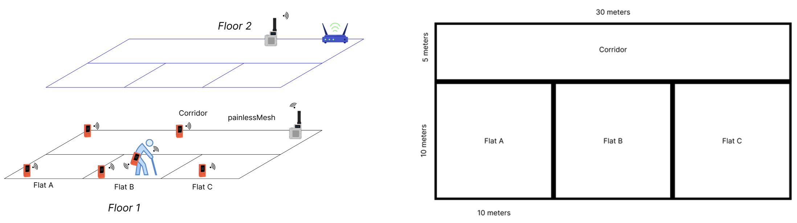
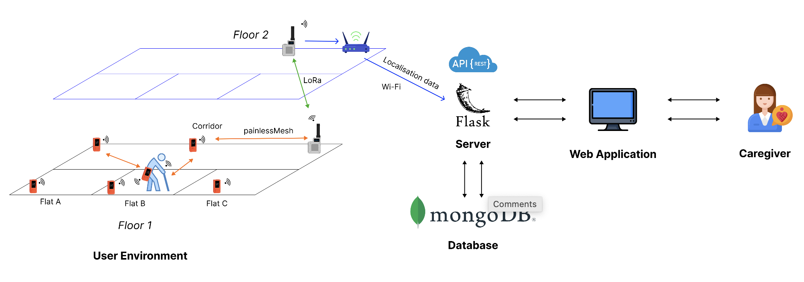

## Table of Contents
1. [Team](#csc2106-iot-elderly-tracking-system)
2. [Overview](#overview-elderly-tracking-and-monitoring-system)
3. [System Design](#system-design)
4. [Requirements](#requirements)
5. [Getting Started](#getting-started)

## CSC2106 IoT Team 2
- Peter Febrianto Afandy (*2200959*)
- Lionel Sim Wei Xian (*2201132*)
- Ashley Tay Yong Jun (*2200795*)
- Joshua Lim (*2200687*)
- Colin Ng Kar Jun (*2200920*)

## Overview (Elderly Tracking and Monitoring System)
The increasing number of elderly individuals living independently in Singapore or with conditions such as dementia presents a critical challenge for caregivers and society at large. With a significant portion of the elderly population at risk of getting lost or encountering emergencies without immediate assistance, there is an urgent need for innovative solutions to monitor and ensure their safety within their living environments. 

The absence of effective and precise indoor tracking systems within residential compounds intensifies this issue, as it hinders the ability of caregivers to promptly determine the location and well-being of their elderly dependents and despite the government’s efforts, there remain untapped opportunities for the direct integration of technology into elderly-focused estates.

Building upon these efforts, we propose the development of a **comprehensive elderly tracking system**, which will be directly integrated with these elderly-focused estates. A hybrid of Wi-Fi and LoRa technologies are used for elderly tracking, with support for geofencing of predefined areas. 



## System Design


Main Features:
- Near real-time tracking of elderly within housing estate
- Direct integration with elderly-focused housing estates
- Geofencing capabilities, with alerts sent to caregivers when elderly are away
- Deployment in resource-constrained environments (only requires access to one Wi-Fi access point)
- Encrypted communications

Technologies Used:
- LoRa, 2.4GHz (for message passing)
- Wi-Fi, 2.4 GHz (for indoor positioning and geofencing)
- HTTP (REST)
- Twilio (for sending SMS alert messages to caregivers)
- MongoDB (for storing application data)
- Flask (server to handle application operations)

Considerations:
- Range 
    - LoRa (2 – 5km), suitable for inter-floor message passing
    - Wi-Fi (up to 90m), suitable for intra-flat and intra-floor positioning

        **Extra range chosen to accommodate potential interference and issues (e.g thick walls)*
- Power Consumption
    - LoRa (low)
    - Wi-Fi (medium)
        
        **Used over GPS which has high power consumption*
- Data Rate and Frequency
    - LoRa (< 50kbps, 2.4GHz), suitable for simple message passing
    - Wi-Fi (0.1 – 54 Mbps, 2.4GHz), suitable for simple communications
    - Mitigations for shared 2.4GHz band by Wi-Fi and LoRa
        - Interrupt-based execution
        - Flag-based switching of protocols to reduce concurrent utilization of both technologies.
        - Different channels on same frequency band 
        - LoRa uses Chirp Spread Spectrum modulation, robust to interference
- Cost
    - LoRa (medium)
    - Wi-Fi (medium)

        **Message passing of LoRa with painlessMesh only requires ONE wireless access point*

## Requirements
- Hardware
    - Lilygo T3-S3 V1.2 (minimum of two, but three is recommended for floor-floor communications)
    - M5StickCPlus (minimum of four)

- Software
    - Radiolib (LoRa)
    - painlessMesh (WiFi)
    - Flask (server)
    - HTML/CSS/JavaScript (dashboard)
    - Python
    - MongoDB

## Getting Started
<ins>Pre-Requisites for M5StickCPlus</ins>
- Follow the instructions [here](https://docs.m5stack.com/en/quick_start/m5stickc_plus/arduino) to set up Arduino IDE before flashing the firmware to the M5StickCPlus devices.

<ins>Pre-Requisites for Lilygo T3-S3 V1.2</ins>
- Ensure the following are installed on Arduino IDE when flashing the firmware to the `LILYGO` devices:
    - Board Manager
        > Install `esp32 by Espressif Systems`
    - Library Manager
        > Install `ESP8266 and ESP32 OLED driver for SSD1306`
- When flashing the LILYGO devices, choose `ESP32S3 Dev Module` as the board type

<ins>Deployment Instructions</ins>
1. Plan out position of secondary painlessMesh nodes (M5)
2. Flash secondary painlessMesh nodes (M5)
3. Flash user painlessMesh nodes (M5)
4. Flash main painlessMesh nodes / secondary LoRa nodes (LLG)
5. Flash transmitter LoRa nodes (LLG)
6. Placement of LoRa nodes in 2 floors (LLG)
7. Placement of painlessMesh nodes (M5)
8. Assign mobile node to elderly
9. Ensure that the Flask server is running and deployed on a publicly accessible IP address
    -  Ensure that you have `python3` and `pip3` installed on your machine. Click here for installation instructions if they are not already installed.

    -  Create a Python `virtualenv` on your local environment:
        ```
        python3 -m venv .venv
        ```

    -  Activate your created `virtualenv`:
        ```
        source .venv/bin/activate
        ```

    -  Install the necessary program dependencies for this project by running the following command on a terminal:
        ```
        pip3 install -r requirements.txt
        ```
    
    -  Run the server
        ```
        python3 server.py
        ```

To view a demo of the application, click [here](https://www.youtube.com/watch?v=MJQ3HeDBlzA) or scan the QR-code below!


